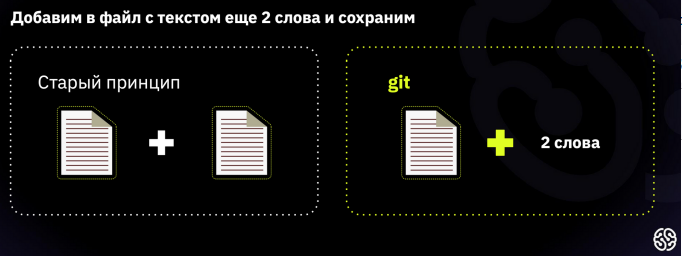

# Git - программа для контроля версий.

Программа [Git](https://git-scm.com/downloads) берёт на себя контроль версий проекта и позволяет переключаться между ними. 

**Обратите внимание**: Git хранит не файлы целиком, а отличия между ними. Это позволяет экономить память. 

Автор программы — *Линус Торвальдс*, создатель ОС Linux. 

## Команды Git

Осваивать Git проще в процессе редактирования текстовых файлов. Markdown – язык разметки, который позволяет форматировать текст. Для написания в редакторе [VS Code](https://code.visualstudio.com/) используется синтаксис языка.

Все команды задаём при помощи написания кода в терминале.

>**git --version** - проверяет текущую версию программы.

>**git init** - инициализация (в папке создаётся скрытая папка .git).

>**git status** - показывает текущее состояние гита, есть ли изменения, которые нужно закоммитить 
(сохранить).

*Чтобы вызвать ранее введённую команду, пользуемся стрелками на клавиатуре. Перебираем недавно введённые команды нажатием стрелки «вверх».*

>**git add** - добавляет содержимое рабочего каталога в индекс (staging area) для последующего коммита.

>**git commit** - зафиксировать или сохранить.

>**git log** - журнал изменений.

>**git checkout** - переключение между версиями.
>>Для работы нужно указать не только интересующий вас коммит, но и вернуться в тот, где работаем, при помощи команды **git checkout master**.

*Нажатие клавиши ‘q’ возвращает в исходное окно терминала.*

>**git diff** - показывает разницу между текущим файлом 
и сохранённым.
>>Перед переключением версии файла в Git 
используйте команду **git log**, чтобы увидеть 
количество сохранений.

_Git отслеживает файлы по имени! Если изменить имя файла, необходимо добавить файл с новый именем + **git commit**_.

>**git branch** - вывести на экран ветку где находимся.
>>**git branch <название новой ветки>** - создать ветку.

>**git checkout** - переключение с одой ветки на другую.

>**git merge<имя ветки для слияния с текущей>** - слияние любой ветки с текущей.

>**git branch -d<имя ветки которую хотим удалить>** - удаляем ветку.

>**git ignore** - исключаем ненужные файлы из загрузки.

>**git log --graph** - визуализация всех веток в виде дерева.

>**git clone <адрес репозитория, который копируем на ПК>**- копировать внешний репозиторий на свой ПК.

>**git pull** - команда позволяет скачать все из текущего репозитория и автоматически сделать *merge* с нашей версией.

>**git push** - отправить свою версию репозитория во внешний репозиторий.

**Как настроить совместную работу**.

1. Создать аккаунт на Git.Hub.com
2. Создать локальный репозиторий
3. “Подружить” ваш локальный и удаленный репозитории.
4. Отправить (push) на локальный репозиторий в удаленный (на GitHub).
5. Провести изменения “с другого компьютера”
6. Выкачать (pull) актуальное состояние из удаленного репозитория.

>**pull request** - команда для предложения изменений, запрос на вливание изменений в репозиторий.

**Как сделать pull request:**
1. Делаем (ответвление) репозитория
2. Делаем *git clone* версии репозитория
3. Создаем новую ветку и в НЕЕ вносим свои изменения
4. Фиксируем изменения (делаем коммиты)
5. Отправляем свою версию в свой GitHub
6. На сайте GitHub нажимаем кнопку *pull request*

## Дополнительные материалы

1. [Книга “Git для профессионального программиста”](https://gbcdn.mrgcdn.ru/uploads/asset/4245110/attachment/d4eb8c232f8f2bdf4e42ba7cb49e0c50.pdf)

2. [Статья](https://gb.ru/posts/soveti-pro-git) про папки, репозитории и некоторые сложности при освоении контроля версий.

3. [Дополнительный курс по Git](https://gb.ru/courses/1117).