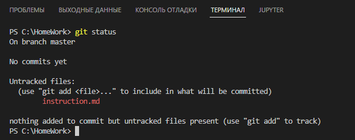
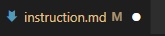
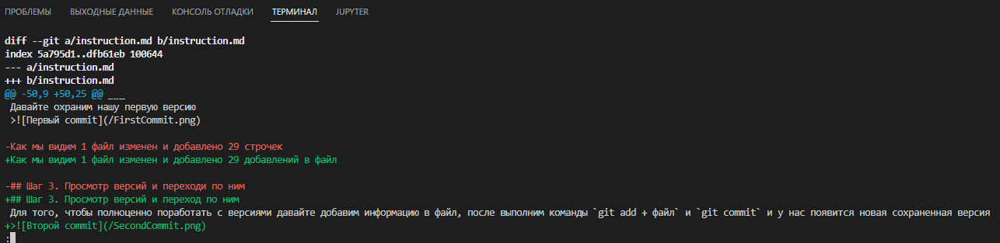

<!-- Создаем инструкцию Git для домашнего задания №1, будем создавать пошагово -->
# Инструкция по Git
## Шаг 1. Загрузка Git и подготовка к работе
Переходим на сайт <https://git-scm.com/downloads>  
Выбираем нашу операционную систему и устанавливаем его
>![загрузка Git][load] 
___
Создаем папку для будет храниться репозиторий (место, где будет храниться версии нашего проекта)
>  
Для примера мы создали папку HomeWork. Путь к папке должен быть на английском языке иначе могут возникать ошибки
___
Открываем программу VS Code ( скачать ее можно [Здесь](https://code.visualstudio.com/) ). Нажимаем Файл - Окрыть папку - Выбираем созданную папку `HomeWork` - Открыть. После этого мы будем работать в этой папке.  
В проводнике нажимаем создать файл
>

И создаем файл Instruction.Md, где будет у нас храниться инструкция
>  
Расширение md означает, что в нашем файле мы будем использовать разметку MarkDown
___
Теперь мы готовы создавать инструкцию и использовать Git

## Шаг 2. Инициализация Git и первая сохраненная версия
Откройте в VS Code терминал, здесь мы будем вводить основные команды.  
Самое первое что мы должны сделать - инициализировать Git.  
Для этого в терминале набираем команду `git init`
>  
Нам выходит сообщение о инициализации Git и создания скрытой папки .git

Можно посмотреть созданную скрытую папку .git в нашей папке репозитария  
___
Для того, чтобы понять текущее состояние репозитария набираем команду `git status`
>  
On branch master - мы находимся на ветке мастер  
No commits yet - говорит, что у нас нет сохраненных версий  
Untracked files - перечисляет нам неотслеживаемые файлы

Как мы видим наш файл instruction.md выделен красным и не отслеживается Git    
Для того, чтобы Git его отслеживал нам подсказывают команду `git add` и название файла (полностью название файла можно не набирать, а только набрать первые несколько букв и нажать на клавишу tab). Набираем команду и снова вводим `git status`
>  
Change to be commited - показывает отслеживаемые файлы  
Если файл отмечен зеленым - файл находится в актуальном состоянии, а если красным - то в файле есть изменения и необходимо его обновить командой `git add`

Как мы видим теперь файл отслеживается и находится в актуальном состоянии
___
Теперь нам необходимо сохранить свою первую версию файла для этого набираем команду `Git commit` также можно добавить `-m`, что означает message и в ковычках добавить комментарий.  
Но прежде, чем мы это сделаем мы должны посмотреть, все ли изменения сохранены в самом файле и если мы видим жирную точку
>

То нам необходимо сохранить нажав клавишу `ctrl + s`  
Давайте охраним нашу первую версию
>

Как мы видим 1 файл изменен и добавлено 29 добавлений в файл

## Шаг 3. Просмотр версий и переход по ним
Для того, чтобы полноценно поработать с версиями давайте добавим информацию в файл, после выполним команды `git add + файл` и `git commit` и у нас появится новая сохраненная версия
>

Для того, просмотреть сохраненные версии вводим команду `git log`
>  
Желтым после коммита написан Хеш commit, его название  
Author - кто создал commit  
Date - время создания commit

Для того, чтобы перейти в какой-либо commit необходимо набрать команду `git checkout` и первые символы Хеш
>

Для возвращения в текущую версию необходимо набрать `git checkout master` или с хеш последней версией

## Просмотр изменений в версиях
Для того, чтобы посмотреть изменения в версиях необходимо перейти в более позднюю версию командо `git checkout` и набрать команду `git giff` + первые символы хеш того сохранения, с которыми хотите сравнить
>

Здесь мы видим:
* какие файлы добовлялись или удалялись
* Какая информация (строчки) добавлялись, корректировались или удалялись

## Создание и навигация по веткам
Для того, чтобы работать с информацией (кодом) не влияя на основную ветку, необходимо создать дополнительную ветку и работать с ней  
Для начала проверим наше текущее состояние по веткам, для этого воспользуемся командой `git branch`
>

Как мы видим, у нас есть только одна ветка - Мастер. Для того, чтобы создать новую ветку необходимо набрать набрать команду `git branch` и название ветки, давайте создадим новую ветку NewBranch. Но перед тем, как мы это сделаем, мы сохраним изменения и создадим commit.
>

Как мы видим мы сейчас находимся на ветке Мастер, но у нас появилась новая ветка newbranch. Для того, чтобы создать и сразу перейти на новую ветку можно воспользоваться командой `git checkout -b` и название ветки. Давайте создадим и сразу перейдем на ветку branch.
>

Как мы видим, мы не только создали ветку, но и сразу на нее перешли. Кроме того, для того чтобы сохранить все изменения мы не писали команду `git add`, а добавили в `git commit` перед m букву а, что позволило сохранить все изменения.   
___
Для того, чтобы перемещаться по ветка мы воспользуемся уже знакомой нам командо `git checkout`.
>

Как мы видим, мы перешли на ветку newbranch  
## Слияние и удаление веток
Для того, чтобы посмотреть на текущую ситуацию с ветками нажмем команду `git log`
>

Как мы видим на текущем коммите находится ветки Master и newbranch, а на прошлом коммите находится ветка branch.  
Сейчас мы с Вами находимся на ветке newbranch, давайте внесем информацию в файл и закоммитим его. После командой `git log --oneline`, которая покажет упращенный список коммитов, посмотрим, что изменилось
>

Как мы видим у нас появились изменения в ветке newbranch, которых нет в ветке мастер. Теперь мы перейдем в ветку Мастер и произведем слияние ее с веткой newbranch, командой `git merge` newbranch.
>

Как мы видим у нас произошло слияние Мастер с веткой newbranch. И теперь вся информация из ветки newbranch попала в ветку Мастер.

## Решение конфликтов при слиянии
До этого мы разобрали слияние, когда бы изменена одна ветка и такое слияние называется FastForward, но такое бывает очень редко и изменения происходят в обеих ветках и тогда может возникнуть конфликт.  
Для того чтобы создать его специально сделаем изменения в одной и той же строке в разных ветках и сделаем коммиты в них
>

После, мы переходим на ветку мастер. После набирает команду `git merge` newbranch
>

Мы видим, что у нас возник конфликт, так как git не знает какая версия строки верна и он просит нас самим выбрать. У нас появляется окно выбора
>

Здесь мы можем либо ручками что-то удалить, либо нажать на кнопку `разрешить в редакторе слияния`. Давайте нажмем на эту кнопку
>

Здесь мы можем сравнить две версии и вывести внизу контрольную версию и нажать на кнопку завершить слияние.   
После нажатия кнопки завершить слияние у нас конфликт будет исчерпан.
___
 После того как мы совершили слияния с ветками, то необходимость этих веток теряется и можно их удалить c пощью команды `git branch -d` название ветки.
 >
 
 Как мы видим обе созданные ветки у нас удалены и у нас останется одна ветка мастер.
 ## Регистрация на сервисе GitHub
 Работать можно не только на локальном репозитарии, но и на удаленном. Это удобно, когда работает сразу несколько участников над одном проектом.  
 Одно из мест, где можно хранить удаленный репозитарий - это сервис GitHub.  
Для того, чтобы зарегистрировать на сервисе GitHub необходимо перейти на [Сайт GitHub](https://github.com/) и произвести регистрацию.  
Для того чтобы создать репозитарий необходимо нажать на +, а для того, чтобы посмотреть список репозитариев необходимо нажать `Your repositories`:  
> 

Здесь мы можем увидеть все наши репозитарии, а также создать новые репозитарий нажав на кнопку `New`  
>

## Создание нового удаленного репозитария
Для того, чтобы создать новый репозитарий нажмем на кнопку `New`
>
Owner - владелец репозитария
Repository name - название репозитария, я ввел `NewRepo`
Description - описание репозитария  
Public или Private - если мы хотим сделать репозитарий публичным, то выбирает Public, если нет то выбираем Private  
Add a README file - если мы хотим автоматически создать файл readme.md, то необходимо поставить галочку  
Для окончания создания репозитория необходимо нажать на кнопку `Create repository`

После создания репозитория GitHub автоматически создает первый коммит, фиксируя первоначальное состояние.

## Клонирование репозитария на локальный компьютер
Для того, чтобы клонировать репозиторий необходимо создать папку куда собираетесь клонировать, давайте создадим для него специальную папку `NewRepo`
>

Далее нам необходимо скопировать ссылку нашего репозитория, для этого заходим на наш репозитория и нажимаем на кнопку `code` и копируем ссылку
>

После того, как мы скопировали ссылку, мы переходим в VS Code в терминал, открываем в нем папку, которую создали и набираем команду `git clone` + ссылка и нажимаем enter.
>

После выполнения команды `git clone` вся информация , которая хранилась на вашем удаленном репозитарии скопировалась на Ваш компьютер

## Отправка изменений на удаленный репозитарий
Для того, чтобы отправить изменения, мы в начале должны произвести эти изменения, сохранить их и закомитить.  
После, мы выполняем команду `git push`
>

Как мы видим, информация была отправлена, теперь мы возвращаемся в GitHub и смотрим, произошли у нас изменения с репозиторием.
>

Как мы видим изменения репозитория произошло.

## Выгрузка изменений с GitHub
Информация может поменяться не только на локальном компьютере, но и на удаленном репозитории, например изменение произвел другой программист. Давайте сами сделаем изменения, для этого нажмем на файл, который хотим изменить и нажмем на кнопку `Карандаш` тем самым мы перейдем в режим изменения файла, и внесем туда дополнительную информацию
>

GitHub позволяет не просто изменить файл, но и сразу создать Коммит на изменения, для этого нам необходимо опуститься вниз файла, написать комментарий Коммиту и нажать на кнопку `commit changes`
>

После нажатия кнопки `commit changes` изменения наши закоммичены и можно их выгружать, для этого переходим в терминал и вводим команду git pull
>

Как мы видим изменения были выгружены. Главное помнить, что команда git pull просто выгрузит информацию, но и смержет ее.

## Удаление удаленно репозитория
Для того, чтобы удалить репозиторий, необходимо на GitHub зайти в него и нажать кнопку `Settings`
>

После этого нам необходимо опуститься в самый низ и нажать на кнопку `Delete this repository`
>

После появится окошко, где необходимо необходимо ввести название репозитория для подтверждения, можно просто скопировать.
>

После потребуется ввести пароль от GitHub
>

После введения пароля, нас перекидывает на список наших удаленных репозиториев, где мы видим, что репозиторий удален.

## Работа с чужим репозиторием
Для того, чтобы работать с чужим репозиторием, нам необходимо знать ссылку на него, давайте возмем репозиторий <https://github.com/mrpartynick/GitLesson2>  
Перейдя по этой ссылке мы попадаем на чужой репозиторий. Для того, чтобы мы могли рвботать с ним, нам необходимо для начала сохранить этот репозиторий у себя, для этого необходимо нажать на кнопку `fork`
>

После этот репозиторий появится у нас в личном кабинете. Мы можем его клонировать его на локальный компьютер, внести изменения и выгрузить обратно их.  
## Обратная связь по чужому репозиторию
После того как мы выгрузили изменения, мы можем об этом оставить обратную связь для автора этого репозитория, для этого мы переходим на вкладку `Pull Requests` и нажимаем на кнопку `New Pull Request`
>

Здесь мы можем посмотреть наши изменения, прокомментировать их автору и отправить ему. Если он сочтет изменения интересными, то он может их внести в свой код.

[load]: load.png